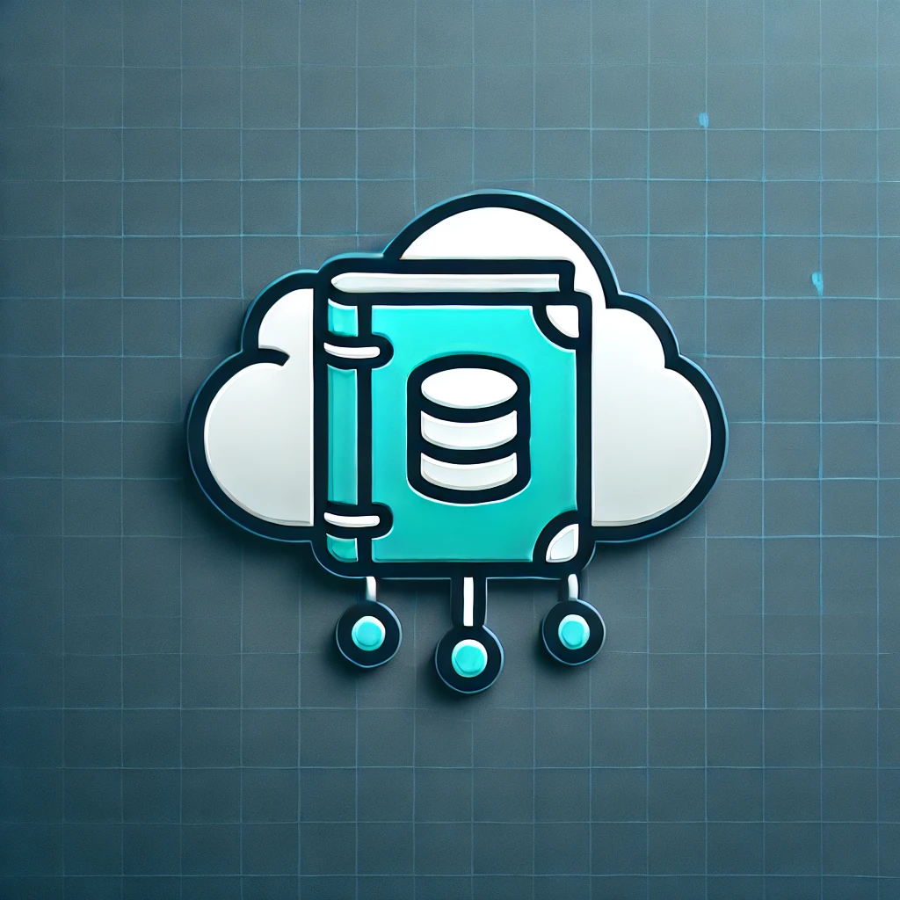

# Brain-Dump
A fast and lightweight note-taking app built with FastAPI and MongoDB. Features include CRUD operations, user authentication, tagging, and search functionality. Designed for efficiency and scalability.

🔹 Tech Stack: FastAPI, MongoDB, JWT Authentication, React (Frontend)
🔹 Features:
✔️ Create, read, update, and delete notes
✔️ Organize notes with tags and categories
✔️ Secure user authentication
✔️ Fast and responsive API

🚀 Get Started: [Installation Guide]
